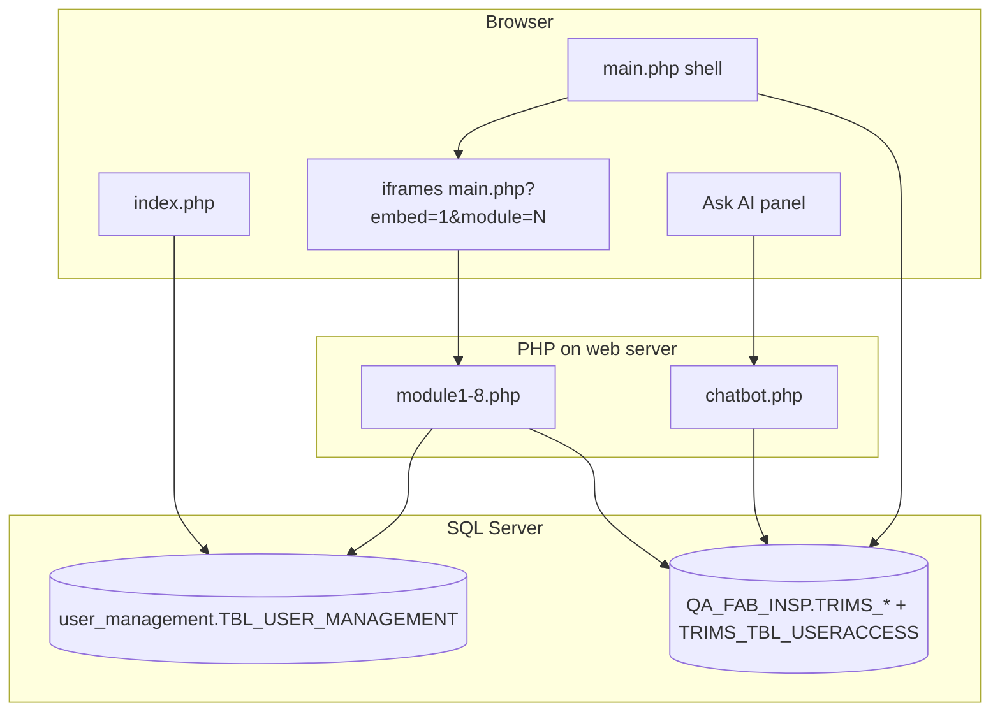

# TRIMS Inspection System — Technical Documentation

This document describes architecture, data flow, security, and how the PHP modules fit together. For installation and a feature summary, see [README.md](README.md).

---

## 1. Overview

TRIMS is a **PHP 5.3** web application backed by **Microsoft SQL Server**, using the legacy **`mssql_*`** API (`mssql_connect`, `mssql_query`, etc.). The UI is **server-rendered HTML** plus **vanilla JavaScript** (no SPA framework).

| Layer | Role |
|--------|------|
| `index.php` | Login; validates credentials against `user_management` |
| `main.php` | Authenticated shell: sidebar, multi-tab iframes, optional access filtering, chatbot trigger |
| `module1.php` … `module8.php` | Feature pages loaded in full page or inside iframes |
| `chatbot.php` | JSON API for the in-app analytics assistant |
| `config.php` | DB connection, `dbQuery` / `dbExec` / parameter interpolation |

---

## 2. High-level architecture



- **Application database** (`DB_NAME` in `config.php`, e.g. `QA_FAB_INSP`) holds inspection data, reference tables, and **`TRIMS_TBL_USERACCESS`**.
- **Accounts database** `user_management` holds **`TBL_USER_MANAGEMENT`** (`username`, `password`). Login and Module 8 read/write here.

---

## 3. Request flows

### 3.1 Login (`index.php`)

1. `session_start()`.
2. POST: load `config.php`, run parameterized query against `user_management.dbo.TBL_USER_MANAGEMENT`.
3. On success: `session_regenerate_id(true)`, set `$_SESSION['username']`, `$_SESSION['logged_in']`, redirect to `main.php`.

Passwords are compared **as stored** (plain text in current design). Hardening would require hashing and a migration path for `index.php` and `module8.php`.

### 3.2 Main shell (`main.php`)

1. **Session guard** — no `logged_in` / `username` → destroy session, redirect to `index.php`.
2. **`config.php`** — load allowed modules for this user from `TRIMS_TBL_USERACCESS` (see §5).
3. **`$requestedModule`** from `?module=`; validated against a fixed list `1…8`.
4. **Embed mode** — `?embed=1`:
   - If the user **is not** allowed that module → short **403-style** HTML body (“You do not have access…”), exit.
   - If allowed and module ∈ `{3,6,7,8}` → **include** `moduleN.php` directly (full HTML document) and exit.
5. **Non-embed** — if user has **no** access rows → `$module = 0` (empty workspace + message). If URL module not allowed → fall back to **first** allowed module.
6. Renders layout: top bar, sidebar (filtered links), tab strip + iframe host; remaining embed loads use `main.php?embed=1&module=N` (see below).

### 3.3 Module iframe (`main.php?embed=1&module=N`)

- For modules **not** in the “full document early exit” set, the bottom of `main.php` outputs a minimal `<main class="embed-only">` and **includes** `moduleN.php`.
- Access is still enforced at the top of `main.php` for every embed request.

### 3.4 Chatbot (`chatbot.php`)

- Requires the same session as `main.php`.
- Accepts **`message`** via POST or GET; returns **JSON**.
- Implements intent detection and SQL over **`TRIMS_TBL_INSPECTION`** (and related logic). Not module-number-gated today; any logged-in user can call it if the UI is available.

---

## 4. Configuration (`config.php`)

| Constant | Purpose |
|----------|---------|
| `DB_SERVER` | SQL Server host / instance |
| `DB_NAME` | Default database for `mssql_select_db` (TRIMS data + `TRIMS_TBL_USERACCESS`) |
| `DB_USER` / `DB_PASS` | SQL login |

Helpers:

- **`dbQuery($sql, $params)`** — SELECT; placeholders `?` expanded via `buildSql()` / `escapeMssql()`.
- **`dbExec($sql, $params)`** — INSERT/UPDATE/DELETE.
- **`buildSql()`** — replaces `?` with escaped literals (no true prepared statements in `mssql_*`).

**Security note:** Ensure `config.php` is **not** committed with production secrets; use environment-specific overrides or restricted deployment paths.

---

## 5. Authentication and module authorization

### 5.1 Who can log in?

Users must exist in **`user_management.dbo.TBL_USER_MANAGEMENT`** with matching **username** and **password** (as implemented in `index.php`).

### 5.2 What can they open after login?

Rows in **`TRIMS_TBL_USERACCESS`** (application DB):

| Column | Usage |
|--------|--------|
| `username` | Same string as `TBL_USER_MANAGEMENT.username` |
| `access_code` | Integer **1–8**, maps **one-to-one** to module numbers |
| `description` | Human label (e.g. “Inspection”); maintained in **Module 8** from a fixed map |

**Semantics:**

- **No rows** for a user → `main.php` treats them as having **no module access** (sidebar empty of permitted items; empty-state message).
- **Embed** for a disallowed module → dedicated “no access” page.
- **Bootstrap:** assign **`access_code = 8`** (User Maintenance) to at least one operator before relying on restrictions, or you may lock out all admin UI.

Module 8 (`module8.php`) implements CRUD on users and **replace-all** rights per username on `TRIMS_TBL_USERACCESS`.

---

## 6. Database objects (conceptual)

Below is a functional map, not a full DDL. Names match code and [README.md](README.md).

| Object | Database | Purpose |
|--------|----------|---------|
| `TBL_USER_MANAGEMENT` | `user_management` | Accounts (`id`, `username`, `password`) |
| `TRIMS_TBL_USERACCESS` | App DB | Per-user module flags |
| `TRIMS_TBL_RAWDATA` | App DB | Raw / import data; IO, PO, supplier, etc. |
| `TRIMS_TBL_INSPECTION` | App DB | Inspection line items, defects, results |
| `TRIMS_TBL_DROPDOWN` | App DB | Reference lists (trim types, brands, …) |
| `TRIMS_TBL_WEEKMONTH` | App DB | Week/month calendar configuration |

Cross-database queries use **three-part names** where needed, e.g. `user_management.dbo.TBL_USER_MANAGEMENT`.

**Optional migrations** under `sql/`:

- `TRIMS_TBL_INSPECTION_add_vessel_columns.sql`
- `TRIMS_TBL_INSPECTION_add_HBL.sql`

---

## 7. Module reference

| # | File | Role |
|---|------|------|
| 1 | `module1.php` | Inspection entry: IO/PO, shipment fields, defects, PASS/FAIL/HOLD/REPLACEMENT |
| 2 | `module2.php` | Dashboard aggregates and charts |
| 3 | `module3.php` | Inspection report grid/filters; PDF via TCPDF/FPDF in `Library/` |
| 4 | `module4.php` | Raw data grid / import / maintenance |
| 5 | `module5.php` | Performance summary by brand / trim |
| 6 | `module6.php` | Dropdown admin (`TRIMS_TBL_DROPDOWN`) |
| 7 | `module7.php` | Week/month admin (`TRIMS_TBL_WEEKMONTH`) |
| 8 | `module8.php` | User Maintenance: `TBL_USER_MANAGEMENT` + `TRIMS_TBL_USERACCESS` |

Many modules expose **`?ajax=...`** or **`$_POST['ajax']`** endpoints returning **JSON**; list/detail/save/delete patterns follow **`module6.php` / `module7.php`** style (MSSQL 2008 paging with `ROW_NUMBER()` where used).

---

## 8. Front-end shell behavior (`main.php`)

- **Sidebar** — “Main Modules”, **Reports** (3, 5), **File Maintenance** (6–8); visibility is **intersected** with the user’s allowed module set.
- **Tabs** — `sessionStorage` key `trims_module_tabs_v1` stores open module IDs and active tab; **scoped by** `$_SESSION['trims_tab_sid']` so a new login does not resurrect old tabs.
- **URL** — `history.replaceState` keeps `main.php?module=N` in sync with the active tab where supported.
- **Mobile** — sidebar toggle and backdrop; same click routing through `openOrFocus` / `trimsOpenModuleTab`.

JavaScript arrays:

- **`validMods`** — fixed `[1,…,8]`.
- **`allowedMods`** — from PHP / `TRIMS_TBL_USERACCESS`; used in `filterValidOrder`, `openOrFocus`, and startup.

---

## 9. Static assets

- **`assets/`** — e.g. hero image for the empty workspace (`main.php`). Paths are relative to the app root.

---

## 10. Security checklist (operators)

- [ ] Restrict SQL logins; least privilege on TRIMS vs `user_management`.
- [ ] Do not expose `config.php` via misconfigured web server.
- [ ] Prefer **HTTPS** in production.
- [ ] Plan password hashing if policies require it (coordinate `index.php` + `module8.php`).
- [ ] Review **chatbot** endpoints for data exposure if not all users should see analytics.

---

## 11. Upgrading PHP

The codebase targets **PHP 5.3 + `php_mssql.dll`**. On **PHP 7+**, use Microsoft’s **`sqlsrv`** (or PDO) and rewrite `config.php` helpers; all modules depend on `dbQuery` / `dbExec` semantics, so keeping the same function signatures minimizes churn.

---

## 12. Repository layout (application files)

```
Trims/
├── index.php
├── main.php
├── config.php
├── chatbot.php
├── module1.php … module8.php
├── README.md
├── DOCUMENTATION.md
├── assets/
├── sql/
└── Library/          # TCPDF, FPDF, helpers (large third-party tree)
```

---

## 13. Change log pointer

Authoritative history is **git**. Notable product areas: inspection schema (`sql/`), dashboard (`module2.php`), reports PDF (`module3.php`), access control (`main.php`, `module8.php`, `TRIMS_TBL_USERACCESS`).

---

*Last updated to reflect module-level authorization and Module 8. Adjust database names and hostnames to match your deployment.*
