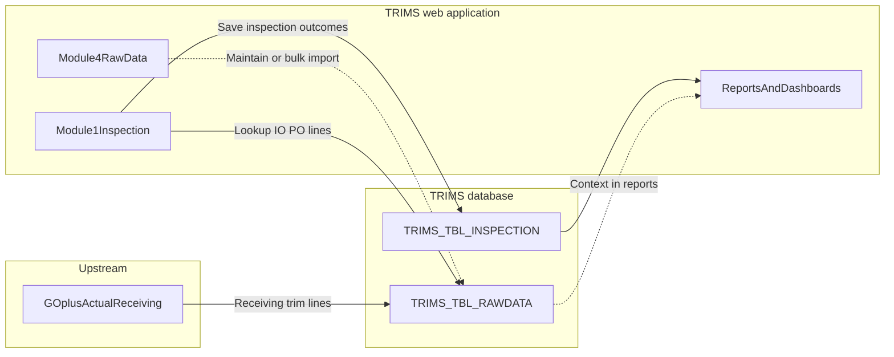

# TRIMS Inspection System — Purpose and Functions

This document explains **why** the TRIMS Inspection System exists and **what** it does for the business. It is written for process owners, QA teams, and IT—not only for developers. For installation and technical architecture, see [README.md](README.md) and [DOCUMENTATION.md](DOCUMENTATION.md).

---

## 1. What problem does this system solve?

**Trims** (trimmings / trim components used in production) must be **inspected for quality** when they are received and before they are used. In your operation, much of the **baseline shipment and line-item information** already exists in upstream logistics and receiving systems—specifically tied to **GO+ Actual receiving**.

Without a dedicated inspection system, teams would:

- Re-type receiving data into spreadsheets or paper forms  
- Lose the link between **what was actually received** and **what was inspected**  
- Struggle to produce **consistent reports** (pass/fail, defects, suppliers, brands) for management and audit  

**TRIMS Inspection System** closes that gap by:

1. **Taking in** trim-related **raw receiving data** (aligned with GO+ Actual receiving) into a controlled **raw data store** in SQL Server (`TRIMS_TBL_RAWDATA`).  
2. Letting inspectors use the **Inspection module** to **pull that context** (IO, PO, supplier, trim lines, shipment identifiers) and **record inspection results** in a structured way (`TRIMS_TBL_INSPECTION`).  
3. Driving **dashboards, inspection reports (including PDFs), performance summaries, and analytics** from the same inspection dataset—so “what we received” and “what we checked” stay aligned and **reporting is automated**.

In short: **GO+ Actual receiving feeds the facts of receiving; TRIMS turns those facts into governed inspection records and management-ready outputs.**

---

## 2. Business context: GO+ Actual receiving and automation

| Concept | Role in the process |
|--------|----------------------|
| **GO+ Actual receiving** | Source of truth (or export) for **actual receipts**: what arrived, under which IO/PO, from which supplier, with which trim/material lines and logistics identifiers. |
| **Raw data in TRIMS (`TRIMS_TBL_RAWDATA`)** | The **operational copy** of that receiving picture inside the TRIMS database, structured so the web application can **look up by IO**, list **POs and lines**, and support **bulk load or maintenance** (see Module 4). |
| **Automation** | Instead of manually reconstructing receiving data at inspection time, the inspector **starts from IO** (and related keys). The system **pre-fills context** from raw data, reducing error and speeding data entry. Final **inspection-specific** fields (defects, quantities inspected, result, dates, week/month) are captured in the Inspection module. |

**Note:** The exact technical link from GO+ to `TRIMS_TBL_RAWDATA` (scheduled job, file drop, manual Excel upload via Module 4, or other integration) is a **deployment choice**. Functionally, the application is designed so that **once raw data is present**, the Inspection module and reports behave consistently.

---

## 3. End-to-end data flow (conceptual)

- **Raw layer:** “What the business knows from receiving (GO+ aligned).”  
- **Inspection layer:** “What QA actually measured and decided (pass/fail/hold/replacement, defects, etc.).”  
- **Reporting layer:** Trends, PDF inspection reports, brand/trim performance, and optional **analytics chatbot** over inspection data.

---

## 4. Core functions by area

### 4.1 Main Inspection module (Module 1)

**Purpose:** Enable **field or lab QA** to perform **structured trim inspections** tied to real receipts.

**Typical workflow:**

1. **Identify the lot** by **IO Number** (and related keys from raw data).  
2. The system resolves **customer**, **PO**, and **supplier / trim lines** from `TRIMS_TBL_RAWDATA` when available (with a fallback path when only prior inspection rows exist for that IO).  
3. Capture **logistics and receipt identifiers** where applicable, for traceability—for example **GR number, vessel, voyage, container, HBL** (aligned with how receiving and shipping are tracked).  
4. Record **inspection-specific** attributes: defect types, **system trim type** (from maintained dropdowns), **week/month** (from calendar configuration), **inspection date**, quantities (**total, inspected, defects**), and **Result** (e.g. **PASSED, FAILED, HOLD, REPLACEMENT**).  
5. **Save** to `TRIMS_TBL_INSPECTION`, **updating** a matching line when the same logical row is inspected again, or **inserting** a new inspection record when appropriate.

**Business value:**

- **Speed:** Less re-keying of data that already exists at receiving.  
- **Accuracy:** Shared reference data (dropdowns, week/month) and validation reduce free-text chaos.  
- **Audit trail:** **Who** inspected and **when** can be stored with the record (`Inspected_by`, `Inspected_Date`, updates).  
- **Consistency:** Results and defect encoding are suitable for **downstream reporting**.

---

### 4.2 Raw data management (Module 4 — “Download Raw Data” in the UI)

**Purpose:** Keep **`TRIMS_TBL_RAWDATA`** complete and trustworthy so the Inspection module’s **IO lookup** and line logic work.

**Functions (as implemented in the product):**

- View / page / sort raw records as needed  
- **Bulk import** (e.g. Excel) into `TRIMS_TBL_RAWDATA` so teams can mirror GO+ Actual receiving batches into TRIMS  
- Maintenance actions appropriate to your process (e.g. corrections or deletions where permitted)

**Business value:** Ensures the **automation bridge** from receiving to inspection stays **fresh** and **reconcilable** with GO+.

---

### 4.3 Report modules and analytics

These modules answer management and customer questions from **`TRIMS_TBL_INSPECTION`** (and related dimensions), not from ad-hoc spreadsheets.

| Module | Business purpose |
|--------|-------------------|
| **Module 3 — Inspection Report** | Operational **inspection report** views with **filters** and **PDF export** for formal documentation or sharing. |
| **Module 2 — Dashboard** | **Visual summary** of inspection results over time with filters such as **date range, supplier, brand**—for daily operations and reviews. |
| **Module 5 — Performance Summary / Brand** | **Deeper performance** views (e.g. by **brand** and **trim type**) for supplier quality and planning discussions. |
| **Analytics Chatbot** | Natural-language **Q&A** over inspection data (totals, defect rates, top suppliers/brands/defects, IO history, time windows). Useful for quick insight without building a new report each time. |

Together, these turn inspection encoding into **repeatable, scalable reporting**—the second half of “automate it” after raw data is in place.

---

### 4.4 Master data and administration

| Module | Purpose |
|--------|---------|
| **Module 6 — Dropdown Menu** | Maintain reference lists (e.g. trim types, defects, brands) used during inspection so codes stay **standardized**. |
| **Module 7 — Week / Month** | Maintain **calendar buckets** used when recording inspections so **weekly/monthly reporting** lines up with the business calendar. |
| **Module 8 — User Maintenance** | Create **user accounts** and assign **which modules** each user may open (`TRIMS_TBL_USERACCESS`), so access matches role (inspector vs report viewer vs admin). |

---

## 5. Who uses what (typical roles)

| Role | Typical use |
|------|-------------|
| **Receiving / data team** | Keep **raw data** synchronized with GO+ Actual receiving (import or integration + Module 4 hygiene). |
| **QA / Inspector** | **Module 1** daily; may use **Module 3** for PDF proof of inspection. |
| **Supervisor / QC lead** | **Dashboard**, **Performance Summary**, **Inspection Report**; may use **chatbot** for ad-hoc questions. |
| **Administrator** | **Dropdowns**, **Week/Month**, **users and access**; database upkeep per IT policy. |

---

## 6. Summary statement

The **TRIMS Inspection System** is the **quality and traceability layer** for **trim inspections** in a process where **GO+ Actual receiving** defines **what actually arrived**. It **automates** the link from that receiving picture into **structured inspection records**, then powers **dashboards, formal reports, and analytics**—with **master data** and **role-based access** keeping the environment controlled and scalable.

For **technical** module filenames, database table names, and security notes, continue with [DOCUMENTATION.md](DOCUMENTATION.md).

---

*This document reflects the intended business use of the system as implemented in the PHP modules and SQL schema. Adjust naming (e.g. GO+ interfaces) to match your organization’s integration agreements.*
